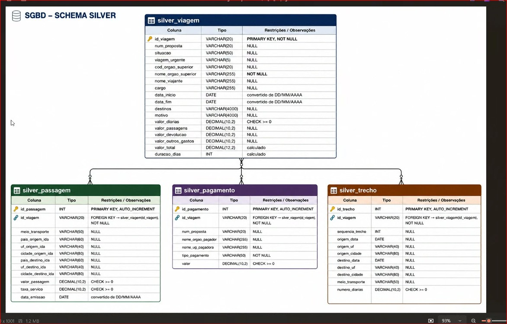

# 🏛️ Pipeline de Dados e Analytics: Gastos Públicos com Viagens a Serviço 🇧🇷

**Projeto Avaliativo — Análise de Dados com Python [T1]**
*Módulo 1 — Semana 13*

---

## 📋 Sumário

1. [Contextualização e Objetivo Executivo](#1-contextualização-e-objetivo-executivo)
2. [Arquitetura do Pipeline (Medallion Architecture)](#2-arquitetura-do-pipeline-medallion-architecture)
3. [Stack Tecnológico](#3-stack-tecnológico)
4. [Estrutura do Repositório](#4-estrutura-do-repositório)
5. [Modelagem Relacional e Qualidade de Dados (Camada Silver)](#5-modelagem-relacional-e-qualidade-de-dados-camada-silver)
6. [Camada Gold: Analytics e Perguntas de Negócio](#6-camada-gold-analytics-e-perguntas-de-negócio)
7. [Insights Estratégicos para Tomada de Decisão](#7-insights-estratégicos-para-tomada-de-decisão)
8. [Guia de Reproducibilidade (Setup &amp; Execução)](#8-guia-de-reproducibilidade-setup--execução)
9. [Conclusão Executiva e Impacto no Negócio](#9-conclusão-executiva-e-impacto-no-negócio)

---

## 1. 🎯 Contextualização e Objetivo Executivo

A transparência na gestão dos recursos públicos é um pilar fundamental da governança contemporânea. Diariamente, o **Portal da Transparência do Governo Federal** disponibiliza grandes volumes de dados abertos. No entanto, os conjuntos de dados relacionados a **Viagens a Serviço (exercício 2025)** são distribuídos em seu formato transacional nativo (`.csv`), apresentando desafios típicos de *Raw Data*: ausência de tipagem forte, anomalias de formatação, redundâncias, encoding heterogêneo e inexistência de amarração relacional entre as entidades.

### A Proposta de Solução

Simulando a atuação de uma **consultoria especializada em Engenharia de Dados**, este projeto propõe o desenvolvimento *end-to-end* de um pipeline automatizado de **ETL/ELT (Extração, Transformação e Carga)** utilizando **Python** e **SQL (PostgreSQL/MySQL)**.

O objetivo é estruturar uma fonte única de verdade (*Single Source of Truth*), garantindo a rastreabilidade integral dos dados públicos, aplicando regras rigorosas de saneamento e modelagem relacional, e disponibilizando uma camada analítica visual para suportar auditorias e tomadas de decisão estratégicas sobre os gastos governamentais.

---

## 2. 🏗️ Arquitetura do Pipeline (Medallion Architecture)

O fluxo de processamento foi desenhado com base no paradigma da **Arquitetura Medallion**, segregando o ciclo de vida do dado em três camadas de maturidade progressiva:

```text
+-------------------+        +--------------------+        +--------------------+        +--------------------+
|   Google Drive    | -----> |     Camada RAW     | -----> |   Camada SILVER    | -----> |    Camada GOLD     |
| (Fonte Bruta Gov) |        |  (Bronze / Ingestão|        | (Refinamento, DDL, |        | (Analytics, KPIs,  |
|  Arquivos .ZIP    |        |    Idempotente)    |        |  Type Casting, FK) |        |  Views e DataViz)  |
+-------------------+        +--------------------+        +--------------------+        +--------------------+
```

* 🥉 **Camada Raw (Bronze — Ingestão e Auditoria):** Responsável pela ingestão dos dados brutos diretamente da fonte oficial sem sofrer mutações de conteúdo (*schema-on-read*). A leitura dos arquivos `.csv` é processada em blocos (*chunks*) via Python e inserida em tabelas (`raw_*`) onde 100% dos atributos são mapeados como `VARCHAR`. Esta camada atua como repositório de auditoria e recuperação histórica. O processo é programado para ser **idempotente** (execução de `TRUNCATE` pré-carga) e **resiliente a falhas** (com tratamento estruturado de exceções `try/except`).
* 🥈 **Camada Silver (Conformidade e Refinamento):** Representa o núcleo relacional do pipeline. Os dados migram das tabelas `raw_*` para `silver_*` passando por rotinas de *data cleansing* e *type casting* (conversão de datas no formato `DD/MM/AAAA` para `DATE` e valores monetários com separador decimal por vírgula para `DECIMAL`). Nesta etapa, estabelece-se a **integridade referencial** (Chaves Primárias e Estrangeiras), eliminam-se duplicidades, aplicam-se restrições de verificação (`CHECK`, `NOT NULL`, `UNIQUE`) e computam-se colunas derivadas de valor analítico (`valor_total` e `duracao_dias`).
* 🥇 **Camada Gold (Consumo Analítico e Inteligência de Negócio):** Camada otimizada para consulta analítica e visualização de dados (*DataViz*). Construída no notebook Jupyter (`3_analise.ipynb`) e materializada no SGBD sob a forma de **Tabelas Agregadas** e **VIEWS** (`gold_*`), agregando métricas complexas por meio de junções relacionais (`JOIN`) e agrupamentos (`GROUP BY`) para responder às diretrizes executivas do órgão de controle.

---

## 3. 🛠️ Stack Tecnológico

A seleção das ferramentas priorizou bibliotecas de padrão industrial para engenharia de dados, visualização e controle de versionamento:

| Categoria                          | Tecnologia                      | Finalidade no Projeto                                                                                                        |
| :--------------------------------- | :------------------------------ | :--------------------------------------------------------------------------------------------------------------------------- |
| **Linguagem Core**           | Python 3.12+                    | Orquestração do pipeline, processamento de*streams/chunks* e automação de I/O.                                         |
| **SGBD & ORM**               | PostgreSQL / MySQL / SQLAlchemy | Armazenamento relacional, execução de comandos DDL/DML e*engine* de conexão de alta performance.                        |
| **Manipulação de Dados**   | Pandas & NumPy                  | Engenharia de atributos,*type casting*, higienização e agregações na camada analítica.                                |
| **Visualização (DataViz)** | Matplotlib & Seaborn            | Geração de gráficos estatísticos e painéis visuais com formatação executiva (eixos, legendas e paletas padronizadas). |
| **Versionamento**            | Git & GitHub                    | Controle de versão baseado no fluxo de*feature branches* e *commits* semânticos e padronizados.                        |

---

## 4. 📂 Estrutura do Repositório

O design do projeto adota uma arquitetura modular, onde cada script executa uma etapa específica do pipeline ETL, minimizando acoplamentos e facilitando a manutenção:

```text
pipeline_dados_transparencia/
│
├── graficos/             # [Saídas] Pasta com os gráficos PNG exportados na Camada Gold
├── image/                # [Mídia] Imagens de suporte à documentação e diagramas (MER)
│   └── 1783772110299.jpg # Diagrama Relacional da Camada Silver
│
├── 0_criar_banco.sql     # [Fase 0] DDL: Criação do Schema e das 8 tabelas (Raw + Silver) com PKs, FKs e Constraints
├── 1_extrair.py          # [Fase 1] Extração: Download automatizado do Drive, processamento em chunks e carga Raw
├── 2_transformar.py      # [Fase 2] Transformação: Saneamento, type casting, cálculo de atributos e carga Silver
├── 3_analise.ipynb       # [Fase 3] Camada Gold: Consultas SQL analíticas, DataViz e materialização de Views
│
├── banco.py              # Módulo gerenciador de conexões, transações e inserções em lote no SGBD
├── config.py             # Parser seguro de variáveis de ambiente e mapeamento de diretórios
│
├── .env                  # Variáveis de ambiente locais (credenciais de banco - excluído via .gitignore)
├── .env.example          # Template padronizado de credenciais para verificação e setup local
├── .gitignore            # Diretrizes de exclusão de binários, ambientes virtuais, zips e csvs
├── requirements.txt      # Manifesto de dependências e bibliotecas Python (congelado via pip)
└── README.md             # Documentação técnica e guia arquitetural do projeto
```

---

## 5. 🗃️ Modelagem Relacional e Qualidade de Dados (Camada Silver)

A modelagem da Camada Silver abandona a estrutura plana dos arquivos CSV e implementa um **Modelo Relacional 1:N (Um para Muitos)** rigorosamente normalizado no banco de dados. A integridade transacional e referencial é garantida nativamente pela *engine* do SGBD, bloqueando a entrada de registros inconsistentes ou órfãos antes de sua disponibilização para as equipes de análise.

### Diagrama Entidade-Relacionamento (MER)

O diagrama abaixo apresenta o *schema* físico da Camada Silver, evidenciando as tipagens, chaves e relacionamentos estruturados no projeto:



#### 🔍 Contextualização e Análise do MER:

* **Centralização Transacional (`silver_viagem`):** Atua como a **entidade-pai (Tabela Fato Principal)** do ecossistema. Ela consolida as **informações principais** da missão institucional (órgão solicitante, servidor viajante, cargo, motivo e datas de início/fim). Note a presença das duas colunas derivadas calculadas via script durante a ingestão: `valor_total` (soma consolidada dos custos da viagem) e `duracao_dias` (intervalo temporal exato do afastamento).
* **Segregação Temática em Tabelas-Filho (Cardinalidade 1:N):** A chave primária `id_viagem` é disseminada como chave estrangeira (`FOREIGN KEY`) para três entidades especializadas, permitindo múltiplos registros atrelados a uma única viagem:
  * `silver_passagem`: Isola os custos de bilhetagem aérea/rodoviária, agenciamento (`taxa_servico`) e datas de emissão.
  * `silver_pagamento`: Categoriza os repasses financeiros (diárias, seguros, devoluções), permitindo auditar o fluxo de caixa através da coluna `tipo_pagamento`.
  * `silver_trecho`: Mapeia a granularidade georreferenciada do itinerário (`origem` ➔ `destino`), controlando a ordem dos voos ou viagens pela coluna `sequencia_trecho`.
* **Evolução de Tipagem (*Type Casting*):** Em contraste com a Camada Raw — onde todas as colunas são `VARCHAR` para aceitar o dado bruto —, o diagrama ilustra o saneamento técnico: campos monetários assumem precisão decimal (`DECIMAL(10,2)` e `DECIMAL(12,2)`), datas são convertidas para o padrão temporal nativo (`DATE`) e sequências utilizam inteiros (`INT`).

### Regras de Governança e Validação (As 8 Constraints DDL)

Para assegurar o padrão de qualidade (*Data Quality*), foram implementadas diretamente no DDL do script `0_criar_banco.sql` exatamente duas restrições de verificação, unicidade e nulidade (`NOT NULL`, `CHECK`, `UNIQUE`) para cada tabela da Camada Silver:

1. **`silver_viagem`:** `NOT NULL` aplicada em `nome_orgao_superior` (obrigatoriedade de atribuição institucional do gasto).
2. **`silver_viagem`:** `CHECK (valor_diarias >= 0)` (prevenção contra anomalias financeiras e diárias negativas).
3. **`silver_passagem`:** `CHECK (valor_passagem >= 0)` (validação de consistência e bloqueio de custos negativos em bilhetes).
4. **`silver_passagem`:** `CHECK (taxa_servico >= 0)` (validação de taxas de agenciamento de turismo).
5. **`silver_pagamento`:** `CHECK (valor >= 0)` (garantia de desembolso financeiro positivo ou nulo).
6. **`silver_pagamento`:** `NOT NULL` aplicada em `tipo_pagamento` (classificação contábil obrigatória para auditoria).
7. **`silver_trecho`:** `CHECK (numero_diarias >= 0)` (consistência temporal de permanência no trecho).
8. **`silver_trecho`:** `UNIQUE (id_viagem, sequencia_trecho)` (chave composta para evitar duplicação de rotas em viagens multi-etapas).

---

## 6. 📈 Camada Gold: Analytics e Perguntas de Negócio

No ambiente analítico (`3_analise.ipynb`), a base relacional Silver é consultada para a estruturação de KPIs (Key Performance Indicators) e relatórios executivos. As 7 perguntas de negócio abaixo foram respondidas utilizando consultas SQL avançadas e traduzidas em visualizações gráficas de alta densidade informativa:

1. **Os 5 órgãos com maior custo total?**

   * *Abordagem Analítica:* Agregação por `nome_orgao_superior` na entidade `silver_viagem`, aplicando a métrica de soma sobre a coluna calculada `valor_total` e ranqueamento em ordem decrescente (Top 5).
   * 📊 **Gráfico:** [Top 5 Órgãos com Maior Custo Total](graficos/1_top5_orgaos_custo.png)
2. **Os 3 destinos com maior custo médio por viagem?**

   * *Abordagem Analítica:* Junção relacional (`INNER JOIN`) entre as tabelas `silver_viagem` e `silver_trecho` para correlacionar o custo total com a localidade final (`destino_cidade`), calculando a média aritmética por município.
   * 📊 **Gráfico:** [Top 3 Destinos com Maior Custo Médio](graficos/2_top3_destinos_custo_medio.png)
3. **A viagem de maior duração e seu custo total?**

   * *Abordagem Analítica:* Busca do valor máximo sobre o atributo derivado `duracao_dias` (diferença em dias entre `data_fim` e `data_inicio`), extraindo simultaneamente o indicador de custo financeiro associado.
   * 📊 **Gráfico:** [Viagem de Maior Duração e Custo Associado](graficos/3_viagem_maior_duracao.png)
4. **Qual o tipo de pagamento com maior valor médio?**

   * *Abordagem Analítica:* Agrupamento da entidade `silver_pagamento` pela dimensão `tipo_pagamento`, computando a média ponderada dos valores liberados (ex.: Diárias vs. Passagens vs. Devoluções).
   * 📊 **Gráfico:** [Média de Valor por Tipo de Pagamento](graficos/4_tipo_pagamento_valor_medio.png)
5. **Qual o meio de transporte mais usado nos trechos?**

   * *Abordagem Analítica:* Análise de frequência (`COUNT`) sobre a coluna `meio_transporte` em `silver_trecho`, evidenciando a distribuição percentual entre modais (Aéreo, Rodoviário, Fluvial, etc.).
   * 📊 **Gráfico:** [Distribuição dos Meios de Transporte](graficos/5_meio_transporte_mais_usado.png)
6. **Qual UF de destino aparece em mais trechos?**

   * *Abordagem Analítica:* Agregação geográfica por `destino_uf` em `silver_trecho`, identificando os polos estatais que concentram o maior fluxo de deslocamento de servidores públicos.
   * 📊 **Gráfico:** [Concentração de Trechos por UF de Destino](graficos/6_uf_destino_mais_frequente.png)
7. **Qual órgão pagou mais no total?**

   * *Abordagem Analítica:* Agrupamento em `silver_pagamento` pelo atributo `nome_orgao_pagador`, somando o volume de repasses para auditar os centros de custo de maior impacto orçamentário.
   * 📊 **Gráfico:** [Top Órgãos Pagadores no Volume Total](graficos/7_orgao_pagador_maior_volume.png)

> 💡 **Materialização Gold:** Para consumo por futuras ferramentas de BI (como Power BI ou Metabase), a consulta agregada principal foi persistida no SGBD sob duas formas: como tabela autônoma (`gold_resumo_gastos`) e como uma visão dinâmica (`CREATE VIEW vw_gold_viagens_consolidada`).

---

## 7. 💡 Insights Estratégicos para Tomada de Decisão

A consolidação da Camada Gold permitiu extrair interpretações críticas sobre a alocação de recursos públicos do exercício de 2025, fornecendo embasamento para auditorias e otimizações orçamentárias:

* **Aplicação do Princípio de Pareto (Curva ABC nos Órgãos):** Os dados revelam alta concentração de gastos: um grupo reduzido de Ministérios (notadamente Defesa, Educação, Saúde e Justiça/Segurança Pública) responde pela maioria esmagadora dos recursos consumidos. *Recomendação:* Estabelecer comitês de auditoria prioritários e negociar acordos corporativos de companhias aéreas com foco específico nesses centros de custo.
* **Hegemonia Econômica do Modal Aéreo:** O transporte aéreo não apenas domina a volumetria dos trechos, mas representa a maior fatia do custo médio por viagem. *Recomendação:* Instituir travas de aprovação para trechos curtos que possam ser substituídos por modais rodoviários ou reuniões virtuais via videoconferência, além de auditar as taxas de agenciamento cobradas por intermediários (`taxa_servico`).
* **Disparidade Geográfica no Custo Médio:** Cidades específicas (frequentemente capitais distantes ou centros isolados) exibem um custo médio por viagem sensivelmente superior ao desvio padrão da base. *Recomendação:* Revisar os tetos de diárias e justificação de urgência (`viagem_urgente`) para missões direcionadas aos destinos no Top 3 de custo médio.

---

## 8. 🚀 Guia de Reproducibilidade (Setup & Execução)

O pipeline foi empacotado para ser executado de forma rápida em qualquer ambiente de desenvolvimento com suporte a Python e um SGBD relacional compatível.

### Pré-requisitos

* **Python 3.12+** instalado localmente no host.
* Instância de **PostgreSQL** ou **MySQL** ativa (localmente via serviço ou container Docker).

### Passo 1: Configuração do Ambiente Virtual e Dependências

Abra o terminal e execute os comandos abaixo na raiz do diretório clonado:

```bash
# 1. Criação do ambiente virtual de isolamento:
python -m venv venv

# 2. Ativação do ambiente virtual:
# Windows (PowerShell/CMD):
venv\Scripts ctivate
# Linux / macOS:
source venv/bin/activate

# 3. Instalação e atualização das dependências do projeto:
pip install -r requirements.txt --upgrade
```

### Passo 2: Parametrização de Variáveis de Ambiente (`.env`)

Por diretrizes de segurança (Twelve-Factor App), credenciais de banco não são hardcoded no código:

1. Duplique o arquivo template executando: `cp .env.example .env` (ou no Windows, copie e renomeie manualmente).
2. Edite o arquivo `.env` gerado com os dados de conexão da sua instância de banco e o ID do Google Drive:

```ini
DB_HOST=localhost
DB_PORT=5432
DB_USER=postgres
DB_PASS=sua_senha_segura
DB_NAME=transparencia_db
DRIVE_FILE_ID=id_do_arquivo_zip_no_google_drive
```

### Passo 3: Execução Cronológica do Pipeline

Execute os módulos sequencialmente via terminal:

```bash
# Fase 0: Geração do Schema e aplicação das tabelas DDL no banco:
python -c "import banco; conexao = banco.conectar(); banco.executar(conexao, open('0_criar_banco.sql', encoding='utf-8').read()); conexao.close()"

# Fase 1: Ingestão de dados brutos do Google Drive na camada Raw (Bronze):
python 1_extrair.py

# Fase 2: Saneamento, conversões tipológicas e carga na camada Silver:
python 2_transformar.py
```

### Passo 4: Inicialização da Análise Analítica (Camada Gold)

Para inspecionar as queries SQL, as tabelas dinâmicas e os gráficos estatísticos gerados:

```bash
jupyter notebook 3_analise.ipynb
```

Ao carregar a interface no navegador, clique em **"Run All" (Executar Tudo)** para renderizar o pipeline analítico e as visualizações em tempo real.

---

## 9. 💼 Conclusão Executiva e Impacto no Negócio

A missão de reestruturar e analisar os dados brutos do **Portal da Transparência** foi concluída com êxito, entregando ao órgão solicitante um pipeline totalmente funcional, auditável e seguro.

Através da segregação em camadas (Raw, Silver e Gold), o projeto resolveu os problemas crônicos de formatação, encoding heterogêneo e falta de tipagem da base original de 2025. O resultado é uma **Fonte Única de Verdade** no banco de dados relacional, capaz de responder de forma rápida e confiável às questões mais críticas sobre o dispêndio de recursos públicos.

As análises visuais e relatórios consolidados entregues na etapa final oferecem aos gestores públicos o embasamento analítico necessário para aplicar princípios de auditoria preventiva, negociar melhores contratos de transporte e reavaliar tetos de diárias, cumprindo com excelência o papel de promover a transparência e a eficiência na gestão governamental.
